# My Blocks Sample

This is a really simple android application showing usage of [My Blocks](https://github.com/langara/MyBlocks) library.

It shows how using `MyActivity` and `MyFragment` base classes can reduce boilerplate code.

The `MyBlocks` library gives you pretty versatile outer layout and material look and behavior ready to use, so you only have to provide the content for your fragment classes. It supports min sdk: 16

##### It uses two navigation panels:

* Global navigation - usually with global menu and/or header (on the left side)
* Local navigation (separate for every fragment) - usually with local menu and/or local header (on the right side)

Those two navigation panels are implemented as drawers, so it does not take your screen if it is small. But it automatically switches to permanent side panel (or two) if the screen is wide enough.

##### App contains only:
* 3 really short java files
* some simple resource files like two xml layouts for fragments and some images.

##### All java code is this:

```java
public class MainActivity extends MyActivity {

    @Override protected void onCreate(Bundle savedInstanceState) {
        super.onCreate(savedInstanceState);
        getGlobalNavigation().inflateHeader(R.layout.global_header);
        getGlobalNavigation().inflateMenu(R.menu.global_menu);
        if(savedInstanceState == null) {
            selectGlobalItem(R.id.fragment1);
        }
    }

}

```

```java
public class Fragment1 extends MyFragment {

    @Nullable @Override public View onCreateView(LayoutInflater inflater, ViewGroup container, Bundle savedInstanceState) {
        inflateMenu(R.menu.local_menu1);
        return inflater.inflate(R.layout.fragment1, container, false);
    }

    @Override public boolean onItemSelected(IMyNavigation nav, MenuItem item) {
        log.w("[SNACK]Item: %s selected.", item.getTitle());
        return true;
    }
}

```

```java
public class Fragment2 extends MyFragment {

    @Nullable @Override public View onCreateView(LayoutInflater inflater, ViewGroup container, Bundle savedInstanceState) {
        inflateMenu(R.menu.local_menu2);
        return inflater.inflate(R.layout.fragment2, container, false);
    }
}
```

And the result looks like this:

* TODO: link to screen record video
* TODO: link to google play


#### Screenshots


###### Nexus 4 portrait

[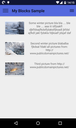](https://raw.githubusercontent.com/langara/MyBlocksSample/master/screenshots/device-nexus4-port-2015-11-18-141603.png)
[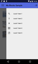](https://raw.githubusercontent.com/langara/MyBlocksSample/master/screenshots/device-nexus4-port-2015-11-18-141647.png)
[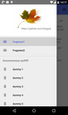](https://raw.githubusercontent.com/langara/MyBlocksSample/master/screenshots/device-nexus4-port-2015-11-18-141730.png)
[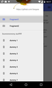](https://raw.githubusercontent.com/langara/MyBlocksSample/master/screenshots/device-nexus4-port-2015-11-18-141747.png)
[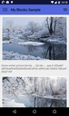](https://raw.githubusercontent.com/langara/MyBlocksSample/master/screenshots/device-nexus4-port-2015-11-18-141808.png)
[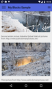](https://raw.githubusercontent.com/langara/MyBlocksSample/master/screenshots/device-nexus4-port-2015-11-18-141822.png)


###### Nexus 7 landscape

[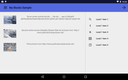](https://raw.githubusercontent.com/langara/MyBlocksSample/master/screenshots/device-nexus7-land-2015-11-18-163417.png)
[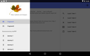](https://raw.githubusercontent.com/langara/MyBlocksSample/master/screenshots/device-nexus7-land-2015-11-18-163502.png)
[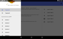](https://raw.githubusercontent.com/langara/MyBlocksSample/master/screenshots/device-nexus7-land-2015-11-18-163529.png)
[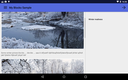](https://raw.githubusercontent.com/langara/MyBlocksSample/master/screenshots/device-nexus7-land-2015-11-18-163629.png)
[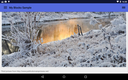](https://raw.githubusercontent.com/langara/MyBlocksSample/master/screenshots/device-nexus7-land-2015-11-18-163820.png)


###### Nexus 7 portrait

[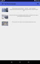](https://raw.githubusercontent.com/langara/MyBlocksSample/master/screenshots/device-nexus7-port-2015-11-18-163923.png)
[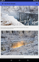](https://raw.githubusercontent.com/langara/MyBlocksSample/master/screenshots/device-nexus7-port-2015-11-18-163959.png)
[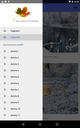](https://raw.githubusercontent.com/langara/MyBlocksSample/master/screenshots/device-nexus7-port-2015-11-18-164021.png)

